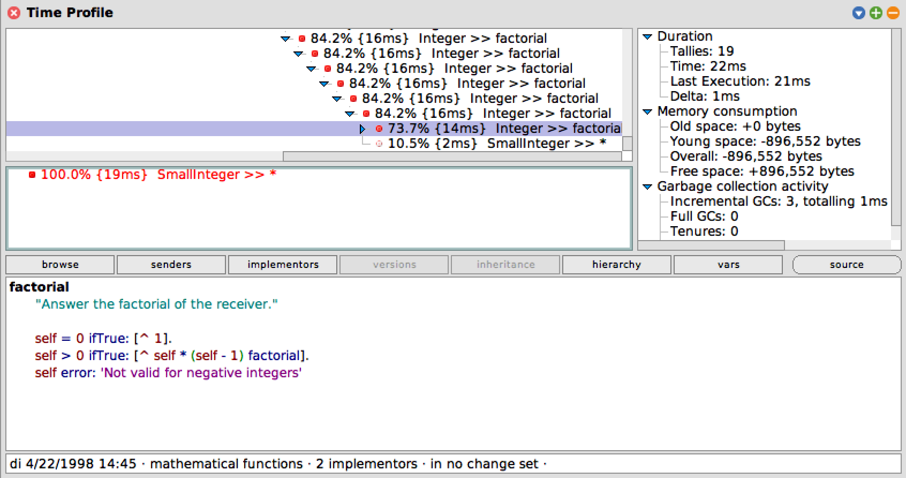
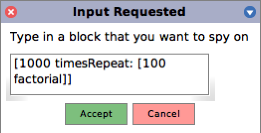

# SWT17-Project-05

## An Interactive Time Profiling Tool for Squeak

### Setup
After installing the tool, make sure to rebuild the main docking bar so that the menu entries for control of the Interactive Profiler appear.
- Right click into World
- Disable "show main docking bar (M)"
- Right click into World
- Enable "show main docking bar (M)" again

### Using the tool
The three different modes of the Interactive Profiler are accessible from the "Extras" menu in the main docking bar as well as via keyboard shortcuts (see the tool tips of the menu entries inside "Extras" for help).

##### Profile a specific block of code
Click "Extras", "Profile Block" to enter a block and profile that block.

##### Profile the last profiled block again
Click "Extras", "Profile Last Block Again".
If you profiled a block and were not happy with the results, you can profile the block again after having made changes to the underlying code to quickly see how the changes affected performance. Notice the entries for "Last Execution" and "Delta" in the duration tree on the right of the results pane.

##### Profile globally
Click "Extras", "Profile Last Block Again".
This simply spies on everything that's happening until you press "Stop".
